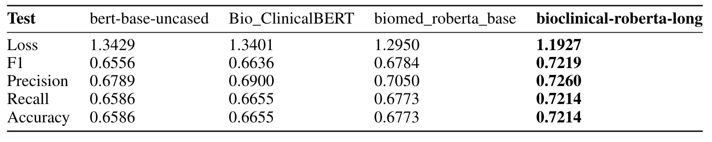
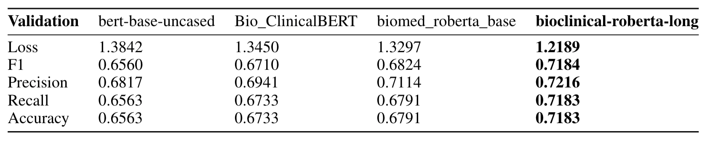
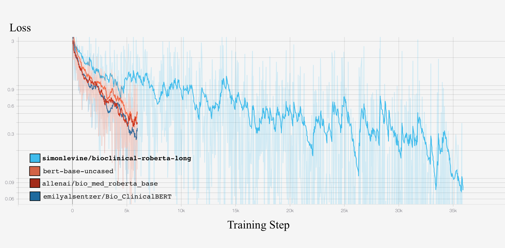

# Clinical-Longformer: Whole Document Embedding and Classification for the Clinical Domain
- Serena Abraham, Simon Levine-Gottreich
- Final course project for Fall 2020's 11-785: Deep Learning, Carnegie Mellon University.

[](https://doi.org/10.5281/zenodo.4396595)

- Skeleton code from https://github.com/ricardorei/lightning-text-classification

- In this project we attempt to circumvent the heavy pre-processing, truncation, etc. of health records instances seen in recent work.

## Writeup
- For a full, writeup of the project, please see https://github.com/simonlevine/clinical-longformer/blob/master/Written%20Submission.pdf

## MIMIC-IV
- MIMIC-IV Discharge Summaries are imminent. Plan (WIP) is to re-pre-train with concatenated MIMIC-III, MIMIC-CXR, and MIMIC-IV. Then, we will attempt to predict ICD-10-CMs from discharge summaries.

## X-Transformer
- See the X-Transformer-ICD submodule for preprocessing scripts/integration with X-Transformer using MIMIC-III.

## Abstract

Using novel pre-training of Transformer encoders, this project tackles whole-document embedding for the clinical domain.  Additionally, we propose a fine-tuning process on electronic healthcare records for transformer models and a novel medical coding benchmark task. We release our best-performing encoder model and suggest future investigation with regard to the natural language tasks in this domain.

## Data
- Concatenated MIMIC-III, MIMIC-CXR, for 2.3 million clinical notes
- MIMIC-IV suggested once released.

## Results
- We achieve SOTA results on our ICD prediction task








## Critical: To Pull the "Longformer":

- You'll need to instantiate a special RoBERTa class. Though technically a "Longformer", the elongated RoBERTa model will still need to be pulled in as such.
- To do so, use the following classes:

```python
class RobertaLongSelfAttention(LongformerSelfAttention):
    def forward(
        self,
        hidden_states,
        attention_mask=None,
        head_mask=None,
        encoder_hidden_states=None,
        encoder_attention_mask=None,
        output_attentions=False,
    ):
      attention_mask = attention_mask.squeeze(dim=2).squeeze(dim=1)
      # These lines may be required for newer versions of HF!
      ###
      # is index masked or global attention
      is_index_masked = attention_mask < 0
      is_index_global_attn = attention_mask > 0
      is_global_attn = any(is_index_global_attn.flatten())
      ###
      return super().forward(hidden_states, attention_mask=attention_mask, output_attentions=output_attentions)

class RobertaLongForMaskedLM(RobertaForMaskedLM):
    def __init__(self, config):
        super().__init__(config)
        for i, layer in enumerate(self.roberta.encoder.layer):
            # replace the `modeling_bert.BertSelfAttention` object with `LongformerSelfAttention`
            layer.attention.self = RobertaLongSelfAttention(config, layer_id=i)
```
- Then, pull the model as ```RobertaLongForMaskedLM.from_pretrained('simonlevine/bioclinical-roberta-long')```
- Now, it can be used as usual. Note you may get untrained weights warnings.
- Note that you can replace ```RobertaForMaskedLM``` with a different task-specific RoBERTa from Huggingface, such as RobertaForSequenceClassification.


# Requirements
```
pandas
tensorboard
torch
transformers
pytorch-lightning
pytorch-nlp
loguru
```

# To Run:

- download the data.
  
- run ICD classification task:
  - *Here, use a transformer as an encoder with a simple linear classifier with tanh activation.*
  - install requirements from requirements.txt in a Python (~3.8+) virtual environment.
  - run *format_mimic_for_ICD_classifier.sh* to clean notes and ready a dataframe. Note that this step can be varied using params.yaml to pull in other code sets (such as ICD procedures) as desired!
  - run *run_icd_classifier.sh*. Note that you may want to alter the hyperparameters used by the training script (BERT vs RoBERTA vs Long-Clinical-RoBERTa, etc.). Theis is done via command line flags (see bottom of classifier_one_label.py)
  - By default, we load in the 50 most frequent primary ICD9 diagnosis codes in MIMIC-III discharge summaries.
    - ['41401', '0389', '41071', 'V3001', '4241', '51881', 'V3000', 'V3101', '431', '4240', '5070', '4280', '41041', '41011', '5789', '430', '486', '1983', '99859', '5849', '5770', '43491', '5712', '99662', '4271', '03842', '99811', 'V3401', '42731', '56212', '4373', '43411', '4321', '41519', '51884', '85221', '570', '03811', '53140', '03849', '4412', '42823', '44101', '42833', '0380', '85220', '4210', '4414', '51919', '5715']
  - By default, Simon + Serena's bioclinical-Longformer is benchmarked with global attention.
    - You should increase batch sizes and you may not need gradient checkpointing if just running roberta or bert.
  - By default, **encoder weights are frozen during training** since we are benchmarking pre-trained encoders as-is, not fine-tuning.
    - The classifier head is still used.
  

- Run masked-language modeling (generate your own clinical encoder!):
  - run *format_mimic_for_ICD_classifier.sh*
    - This will concatenate all of MIMIC-III and MIMIC-CXR, sans those encounters used in test datasets for becnhmarking.
    - This will filter notes for administrative language, some punctuation, etcetera.
  - run *split_data_and_run_mlm_training.sh*
    - We pre-train AllenAI/BiomedRobertaBase as a default, as pre-training with global attention results in severe memory issues (OOM on 200gb VM) and extreme training time requirements (as it is, 300 hours were used to train our 5000-epoch RobertaForMaskedLM model).
    - It's also unclear, given that we "chunk" our entire 2.2 million -encounter corpus, what benefit this would bring.
    - Ideally, someone shoud get a corpus an order of magnitude larger and train document-by-document longformer from scratch...
  - run *elongate_roberta.sh* to pull in a huggingface model and elongate it with global attention.
    - Defaults to 4096 global attention tokens and 512 local.
    - This will convert a roberta model to a longformer, essentially, but allows for larger document ingestion.
    - Note that nothing is stopping you from attempting MLM pre-training using this model rather than roberta.
      - In fact, we provide *pretrain_roberta_long.py* for just that task if you have the resources.

-Run MedNLI:
  -in Progress


- Extension: run X-transformer for MIMIC-III (https://github.com/simonlevine/auto-icd-transformers) using your new encoder:
  - We provide a forked repository using X-Transformer allowing for training your encoder on every ICD code in MIMIC-III, proc or diag, an extreme multilabel classification problem.
  - Some code overlap, such as note preprocessing.


## Time Permitting:
- build a hierarchical classifier head
- get x-transformer trained on our best model.
- The x-transformer pipeline uses the state-of-the-art extreme multilabel classification with label clustering and PIFA-TFIDF features to amke good use of label descriptions. ICD code labels not only have 'ICD9_CODE' labels, but also 'LONG_TITLE' labels with rich semantic information.

- try different losses:
For the multi-label classification, you can try tanh+hinge with {-1, 1} values in labels like (1, -1, -1, 1).
Or sigmoid + hamming loss with {0, 1} values in labels like (1, 0, 0, 1).
In some cases, sigmoid + focal loss with {0, 1} values in labels like (1, 0, 0, 1) worked well.
You can check this paper https://arxiv.org/abs/1708.02002.


# Running the code

## Data

MIMIC-III/CXR data requires credentialed access. This pipeline requires:

- D_ICD_DIAGNOSES.csv.gz (if descriptions of ICDs are wanted)
- D_ICD_PROCEDURES.csv.gz
- NOTEEVENTS.csv.gz (contains, among others, discharge summary texts)
- DIAGNOSES_ICD.csv.gz (contains actual patient visit code assignment)
- PROCEDURES_ICD.csv.gz

We also provide a General Equivalence Mapping if translating codes to ICD10 is desired (these data are relevant but quite old, MIMIC-IV is in the works).

### Preprocess the Data

Data should be in the main working directory, in the "data" folder.

In preprocessing_pipeline, run:
- format_notes.py 
  - cleans discharge summaries of administrative language, etc.
  - experiments with Dask, multiprocessing, etc., were not fruitful. Vectorized operations here still take a few minutes.
  
- format_data_for_training.py , OR, format_data_for_for_multilabel.py
  - depending on your use-case

  
 Finally, in longformer_gen, if you don't want to pull our models from https://huggingface.co/simonlevine: 
 
 - roberta_to_longformer.py
    - if you want to convert your own Roberta to Longformer (with the Longformer speed-fix)
 - elongate_bert.py
    - if you want to model global document token dependencies using BERT.
    
 The classifier_pipeline folder contains scrits for ICD classification and a requirements.txt

### Run training

Run the pytorch-lightning trainer from ~~either training_multilabel.py or~~ training_onelabel.py.

# Background

This project is the course project for Fall 2020, 11-785: Deep Learning, at Carnegie Mellon University.

Here, we benchmark various Transformer-based encoders (BERT, RoBERTa, Longformer) on electronic health records data from the MIMIC-III data lake.
We also benchmark our new pipeline against another novel pipeline developed in 2020 by Simon Levine and Jeremy Fisher, auto-icd-Transformers.


We use base-BERT-uncased as a baseline transformer. We then try bio-clinical-BERT, biomed-RoBERTa, and finally our bespoke "Longformer" bioclinical-roberta-long.

This latter model is simply allenAI's biomed-roberta with global attention, such that documents of up to 4096 token length are able to be used without truncation, a critical aspect of free-text EHR data).

Note that we pre-train allenAI/biomed-RoBERTa-base on MIMIC-III + MIMIC-CXR data for ~1000 epochs (no global attention).
Global attention was not used in MLM because this is costly. We had out of memory issues on a 200gb machine with FP16, gradient checkpointing, and batch size of 1.
Note that A corpus even of this size is likely not sufficient to have dramatic increases in performance, per AllenAI, but it couldn't hurt to try.

So, global attention is used in the end-to-end stage. We recommend you repeat MLM with more data and global attention if you have the resources.

## Transformers

For each transformer, we build a classifier head. As a baseline,, we use

nn.Linear(self.encoder_features, self.encoder_features * 2),
  nn.Tanh(),
  nn.Linear(self.encoder_features * 2, self.encoder_features),
  nn.Tanh(),
  nn.Linear(self.encoder_features, self.data.label_encoder.vocab_size),

where encoder features = 768, vocab_size is simply the number of unique ICDs in the training set (50).

## Labels and Label Manipulation

We ignore label descriptions (see above: this direction was attempted previously by Simon Levine and Jeremy Fisher, adapting the X-transformer pipeline).

### One Label
For ICD-10-CM and ICD-10-PCS, the single-label case is first analyzed. That is, ICD "SEQ_NUM==1" is looked at, as this is generally the most clinically relevant code assigned per patient visit.

### Multi-Label

For the multi-label case, the label space grows. Hence, an "extreme multilabel" classifier is required.
We begin with one-hot encoded ICD codes per instance, with our base 3-layer dense classifier.

Future work should make use of exotic methods for classification in this domain, perhaps hierarchical classification schemes or other (extreme) multilabel implementations.


